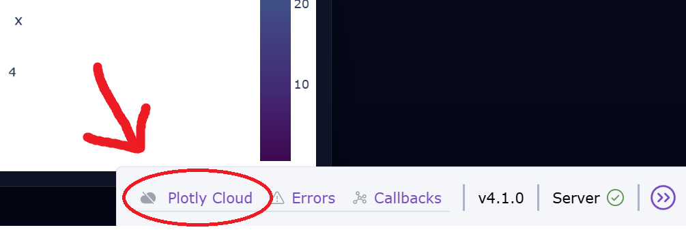
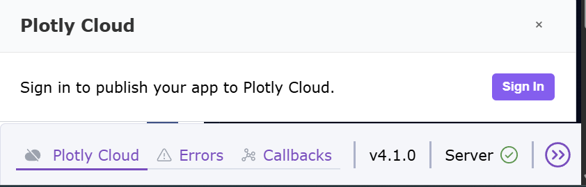
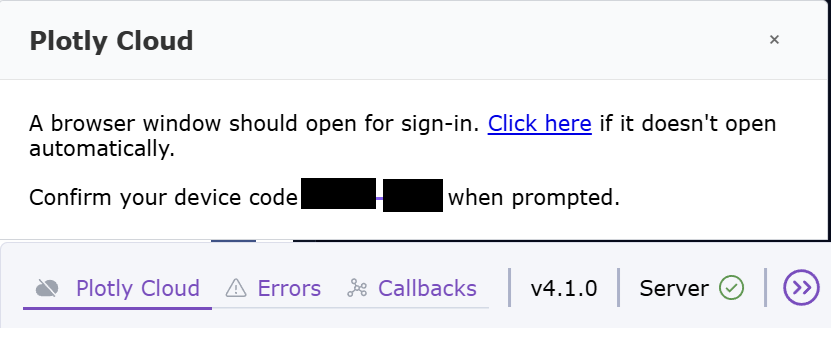
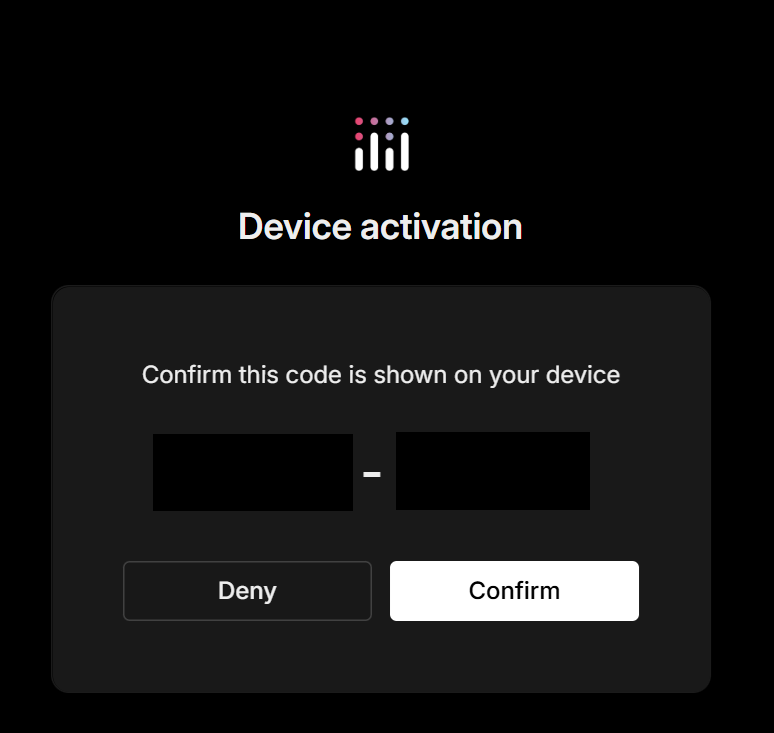
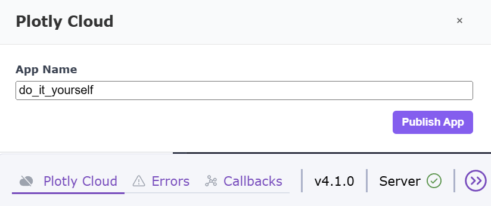

# Deploy apki Dash w plotly cloud

---

## Step 1 - przejdź do katalogu projektu

```bash

cd do_it_yourself/dash_app
```

---

## Step 2 - zainstaluj zależności projektu

```bash

pip install -r requirements.txt
```

---

## Step 3 - doinstaluj wsparcie dla Plotly Cloud

```bash

pip install "dash[cloud]"
```

---

## Step 4 - wpisz swój własny napis

Otwórz plik `app.py`.

Wpisz se swój customowy tekst w linii `7`.

```python
# 🚀✨🎯👉 TU wpisz swój customowy tekst! 🌟🔥💫💥
CUSTOM_TEXT = "67"
```

---

## Step 5 - uruchom aplikację lokalnie
Upewnij się, że jesteś w directory `Plotly-introduction\do_it_yourself`
Następnie uruchom aplikację:
```bash
python app.py
```

Potem otwórz:
http://127.0.0.1:8050/

---

## Step 6 - Kliknij "Plotly Cloud" w prawym dolnym rogu



---

## Step 7 - Sign In


## Step 8 - Po automatycznym przekierowaniu podaj email do którego pamiętasz hasło


## Step 9 - Wybierz email sign in code ( prostsze )

I następnie wklej kod co przyszedł na maila

## Step 10 - Potwierdź urządzenie


Na 99.9% straczy po prostu kliknąć `"Confirm"`

## Step 11 - Wpisz nazwe swojej apki dash + "Publish App"


## Uwaga

Jeśli coś nie działa:
- sprawdź katalog
- sprawdź czy działa lokalnie
- sprawdź dash[cloud]
- sprawdź runtime.txt (python-3.12)
